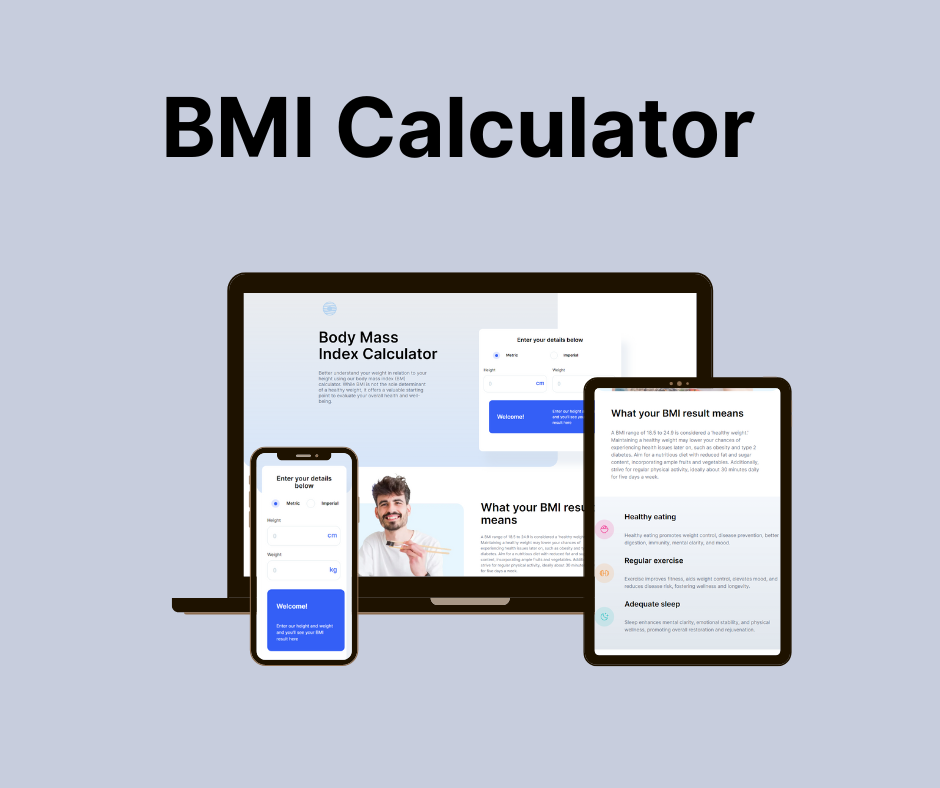

# Frontend Mentor - Body Mass Index Calculator solution


This is a solution to the [Body Mass Index Calculator challenge on Frontend Mentor](https://www.frontendmentor.io/challenges/body-mass-index-calculator-brrBkfSz1T). Frontend Mentor challenges help you improve your coding skills by building realistic projects. 

## Table of contents

- [Overview](#overview)
  - [The challenge](#the-challenge)
  - [Main Features](#main-features)
  - [Installation and Setup](#installation-and-setup)
  - [Links](#links)
- [Directory Structure](#directory-structure)
- [My process](#my-process)
  - [Built with](#built-with)
  - [Road Map](#road-map)
  - [Test Plan](#test-plan)
  - [What I learned](#what-i-learned)
  - [Continued development](#continued-development)
  - [Useful resources](#useful-resources)
- [Author](#author)
- [Acknowledgments](#acknowledgments)


## Overview

### Main Features
Your users should be able to:

- Select whether they want to use metric or imperial units
- Enter their height and weight
- See their BMI result, with their weight classification and healthy weight range
- View the optimal layout for the interface depending on their device's screen size
- See hover and focus states for all interactive elements on the page


### Installation and Setup
### Getting Started
1. Clone the code and prepare the environment
```bash
git clone https://github.com/KarenDouglas/bmi-calculator

cd client
```

2. Install dependencies

```bash
npm i
```
3. To Start dev server
```bash
npm run dev
```
4. To run tests
```bash
npm run test

# to keep test running in background
npm run watch 
# then type "a" to run all tests
```


### Links

- Solution URL: [https://www.frontendmentor.io/solutions/tdd-jest-react-testing-library-react-vanilla-css-LLXME3recx](https://www.frontendmentor.io/solutions/tdd-jest-react-testing-library-react-vanilla-css-LLXME3recx)
- Live Site URL: [https://bmi-calculator-challenge.netlify.app/](https://bmi-calculator-challenge.netlify.app/)

## Directory Structure

```
client/
├─── dist/
│├─── assets/
│└── index.html
├─── node_modules/
├─── src/
│├─── assets/
│├─── components/
││├─── AdviceComponent
││├─── BmiCalcComponent
││├─── BmiDefinitionComponent
││└── LimitationsComponent
│├─── App.jsx
│├─── index.css
│└── main.jsx
├─── tests/
││├─── AdviceComponent.test.js
││├─── bmiCalcCompImperial.test.js
││├─── bmiCalcCompMetric.test.js
││└──LimitationsComponent.test.js
├─── eslintrc.cjs
├─── .gitignore
├─── babel.config.cjs
├─── index.html
├─── package-lock.json
├─── vite.config.js
├─── LICENSE
├─── README.md

```


## My process

### Built with

- [React](https://reactjs.org/) - JS library
- TDD
- Jest
- React Testing Library
- Vite
- NetLify
- Mobile-first workflow
- CSS custom properties
- Flexbox
- Semantic HTML5 markup

### Road Map
- Phase 1: Break project down to components
- Phase 2: Write test for a component
- Phase 3: Pass test for component
- Phase 4: Repeat writing and passing test for each component
- Phase 5: Style component  using mobile first approach one component at a time. 


### Test Plan
- Unit test for components
- Integration tests for user flows and interactions 

### What I learned

### Jest 
During the process of building my project, I learned extensively about Jest and its integration with Babel configurations, particularly for interpreting images. I became proficient in using Jest's matchers to test various conditions, such as truthiness, numerical values, and string patterns. Additionally, I explored the "not" modifier, which allows for more flexible and comprehensive testing by inverting matchers. This experience has enhanced my understanding of creating robust and reliable test suites for JavaScript applications.

### React Testing Library
While using React Testing Library (RTL), I learned its philosophy for creating maintainable tests that facilitate refactoring and ensure that software components function correctly from a user's perspective. RTL encourages avoiding internal state and methods of components, focusing instead on how users interact with the interface. I also delved into different query types, such as getBy, queryBy, and findBy, understanding the specific scenarios for each and prioritizing queries based on accessibility to improve user experience. Additionally, I gained experience in rendering components for testing and using fire events to simulate user interactions, which is crucial for effective integration tests.

### Accessibility
React Testing Library surprisingly taught me a lot about accessibility through its emphasis on prioritizing queries based on accessibility principles. I learned about accessible names, the importance of elements with roles, and which elements should not be aria-labeled. This knowledge has significantly changed the way I think about and interact with the DOM, making me more mindful of creating accessible web applications.


### Continued development

In my continued development, I aim to explore more features of Jest and RTL, such as using mock functions to better isolate certain parts of my code and test them effectively. I also plan to dive into RTL user events, which are recommended over fire events for simulating user interactions. Furthermore, I want to improve my ability to estimate project completion times, acknowledging that I often underestimate the learning curve and the initial challenges before developing a workflow. For future projects, I am committed to incorporating CSS animations into my websites to create a more pleasant viewing experience.


### Useful resources

- [Testing Library](https://testing-library.com/docs/react-testing-library/intro/) 
- [Jest Documentation](https://jestjs.io/docs/getting-started)  


## Author

- LinkedIn: [@KarenDouglas](https://www.linkedin.com/in/karen-douglas-344974246/)
- Frontend Mentor: [@KarenDouglas](https://www.frontendmentor.io/profile/KarenDouglas)
- Twitter: [@CodeNoob4Life](https://twitter.com/CodeNoob4Life)


## Acknowledgments

Thank you so much to Frontend Mentor for providing such great challenges that always help me to grow


